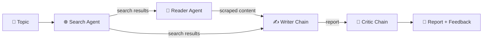

# 🔎 Multi-Agent Research System

An AI research assistant that takes a topic, searches the web, reads the best source in depth, writes a structured report, and then critiques its own work. It is built with **LangChain**, **LangGraph** and **DeepSeek**, with a **Streamlit** web interface.

<!-- Add a screenshot of the app: save it as docs/screenshot.png and uncomment the line below -->
<!--  -->

---

## ✨ Features

- **Four specialised agents** working as a pipeline: Search → Reader → Writer → Critic
- **Tool-using agents**: the search agent queries the web, and the reader agent picks the most relevant URL and scrapes it
- **Robust web scraping** with several extraction strategies (trafilatura, readability, semantic HTML, paragraph fallback) to get clean text from most pages
- **Self-review**: a critic agent scores the report and suggests improvements
- **Streamlit UI** with live step-by-step progress, a timer for each step, tabbed results, run history and Markdown downloads
- **CLI mode**: run the same pipeline from the terminal

---

## 🧠 How it works



| Step | Component | What it does |
|------|-----------|--------------|
| 1 | **Search Agent** | Finds recent, reliable sources on the topic using a web search tool |
| 2 | **Reader Agent** | Picks the most relevant URL from the search results and scrapes its full content |
| 3 | **Writer Chain** | Combines the search results and scraped content into a structured research report |
| 4 | **Critic Chain** | Reviews the report for accuracy, depth and clarity and returns feedback |

The pipeline shares one `state` dictionary across the steps: `search_results`, `scraped_content`, `report` and `feedback`.

---

## 🛠️ Tech stack

- **Python 3.11+**
- **LangChain** / **LangGraph**: agents, tools and chains
- **DeepSeek** (`langchain-deepseek`): the LLM
- **Streamlit**: the web UI
- **Requests**, **BeautifulSoup4**, **trafilatura**, **readability-lxml**: web scraping

---

## 📁 Project structure

```
Multi-Agent-Research-System/
├── app.py                  # Streamlit UI
├── src/
│   ├── agents/
│   │   └── agents.py       # search/reader agents, writer & critic chains
│   ├── tools/              # web search + scrape_url tools
│   └── pipeline.py         # run_research_pipeline() for CLI use
├── requirements.txt
├── .env.example
└── README.md
```
