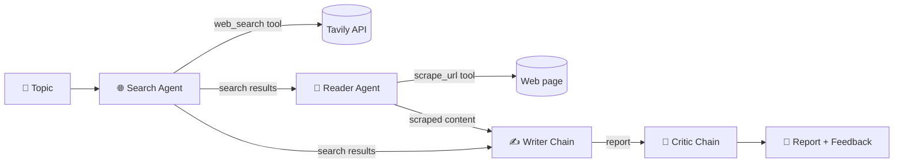

<div align="center">

# 🔎 Multi-Agent Research System

**An AI research assistant that searches the web, reads the best source in depth, writes a structured report, and critiques its own work.**

[](https://www.python.org/)
[](https://www.langchain.com/)
[](https://streamlit.io/)
[](LICENSE)

[Features](#-features) •
[Architecture](#-architecture) •
[Tech stack](#️-tech-stack) •
[Installation](#-installation) •
[Usage](#-usage) •
[Contributing](#-contributing)

</div>

<!-- Add a screenshot of the app: save it as docs/screenshot.png and uncomment the line below -->
<!--  -->

---

## ✨ Features

- **Four-stage pipeline**: Search → Reader → Writer → Critic, each with a single responsibility
- **Tool-using agents**: the search agent queries the web through Tavily; the reader agent picks the most relevant URL and scrapes it
- **Robust web scraping**: falls back through trafilatura, readability, semantic HTML tags and plain paragraphs until it gets clean, readable text
- **Self-review**: a critic scores the report out of 10 and lists strengths and areas to improve
- **Streamlit web UI**: live step-by-step progress, per-step timings, tabbed results, run history and Markdown downloads
- **CLI mode**: run the same pipeline from the terminal

---

## 🧠 Architecture



The system is a sequential pipeline of two **agents** (LLMs that decide when to call tools) and two **chains** (single prompt → LLM → text calls). All four share one DeepSeek chat model.

| Step | Component | Type | What it does |
|------|-----------|------|--------------|
| 1 | **Search Agent** | Agent + `web_search` | Finds recent, reliable sources on the topic (top 5 Tavily results) |
| 2 | **Reader Agent** | Agent + `scrape_url` | Picks the most relevant URL from the search results and extracts its full text |
| 3 | **Writer Chain** | Prompt chain | Combines search results and scraped content into a report: introduction, key findings, conclusion, sources |
| 4 | **Critic Chain** | Prompt chain | Reviews the report and returns a score, strengths, improvements and a one-line verdict |

Data flows between steps through a single `state` dictionary with the keys `search_results`, `scraped_content`, `report` and `feedback`.

**Layers**

- `src/tools/`: LangChain tools (`web_search`, `scrape_url`) that talk to the outside world
- `src/agents/`: the LLM, the agent builders and the writer/critic prompt chains
- `src/pipelines/`: `run_research_pipeline()`, which wires the steps together
- `app.py` / `main.py`: entry points (web UI and CLI)

---

## 🛠️ Tech stack

| Area | Technology |
|------|------------|
| Language | Python 3.10+ |
| Agent framework | [LangChain](https://python.langchain.com/) (`langchain`, `langchain-core`, `langchain-community`) |
| LLM | [DeepSeek](https://platform.deepseek.com/) via `langchain-deepseek` |
| Web search | [Tavily](https://tavily.com/) via `tavily-python` |
| Web scraping | `requests`, `beautifulsoup4`, `trafilatura`, `readability-lxml`, `lxml` |
| Web UI | [Streamlit](https://streamlit.io/) |
| Config | `python-dotenv` |

---

## 📦 Installation

### Prerequisites

- Python 3.10 or newer
- A [DeepSeek API key](https://platform.deepseek.com/api_keys)
- A [Tavily API key](https://app.tavily.com/) (free tier available)

### 1. Clone the repository

```bash
git clone https://github.com/beavon-code/Multi-Agent-Research-System.git
cd Multi-Agent-Research-System
```

### 2. Create a virtual environment

```bash
python -m venv .venv

# macOS / Linux
source .venv/bin/activate

# Windows (PowerShell)
.venv\Scripts\Activate.ps1
```

### 3. Install dependencies

```bash
pip install -r requirements.txt
```

### 4. Configure your API keys

Create a `.env` file in the project root:

```env
DEEPSEEK_API_KEY=your_deepseek_api_key
TAVILY_API_KEY=your_tavily_api_key
```

`.env` is already listed in `.gitignore`, so your keys stay out of version control.

---

## 🚀 Usage

### Web UI

```bash
streamlit run app.py
```

Then open http://localhost:8501, enter a research topic and follow the pipeline as it runs.

### Command line

Edit the `topic` in [main.py](main.py), then run:

```bash
python main.py
```

Each step's output is printed to the terminal.

### As a library

```python
from src.pipelines.pipeline import run_research_pipeline

state = run_research_pipeline("The impact of AI on the job market in 2026")
print(state["report"])
print(state["feedback"])
```

### Changing the model

The LLM is defined in [src/agents/agents.py](src/agents/agents.py):

```python
llm = ChatDeepSeek(model="deepseek-flash", temperature=0)
```

Swap in any LangChain chat model (for example `ChatGroq` from `langchain-groq`, which is already in `requirements.txt`) to use a different provider.

---

## 📁 Project structure

```
Multi-Agent-Research-System/
├── app.py                    # Streamlit web UI
├── main.py                   # CLI entry point
├── src/
│   ├── agents/
│   │   └── agents.py         # LLM, search/reader agents, writer & critic chains
│   ├── tools/
│   │   └── tools.py          # web_search (Tavily) and scrape_url tools
│   └── pipelines/
│       └── pipeline.py       # run_research_pipeline()
├── requirements.txt
├── LICENSE
└── README.md
```

---

## 🤝 Contributing

Contributions are welcome.

1. Fork the repository
2. Create a feature branch: `git checkout -b feature/my-feature`
3. Commit your changes: `git commit -m "Add my feature"`
4. Push the branch: `git push origin feature/my-feature`
5. Open a pull request

For bugs or feature ideas, please [open an issue](https://github.com/beavon-code/Multi-Agent-Research-System/issues).

---

## 📄 License

This project is licensed under the [Apache License 2.0](LICENSE).

## 🙏 Acknowledgements

- [LangChain](https://github.com/langchain-ai/langchain) for the agent framework
- [Tavily](https://tavily.com/) for the search API
- [DeepSeek](https://www.deepseek.com/) for the language model
- [trafilatura](https://github.com/adbar/trafilatura) and [readability-lxml](https://github.com/buriy/python-readability) for content extraction
